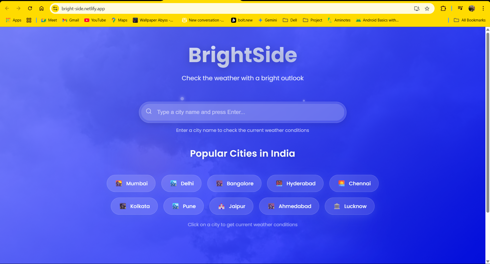
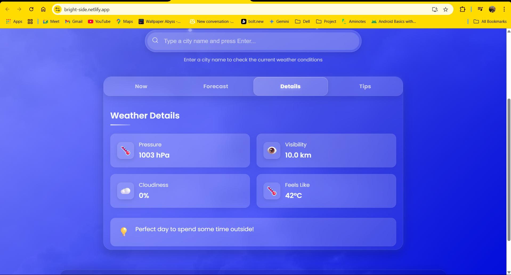
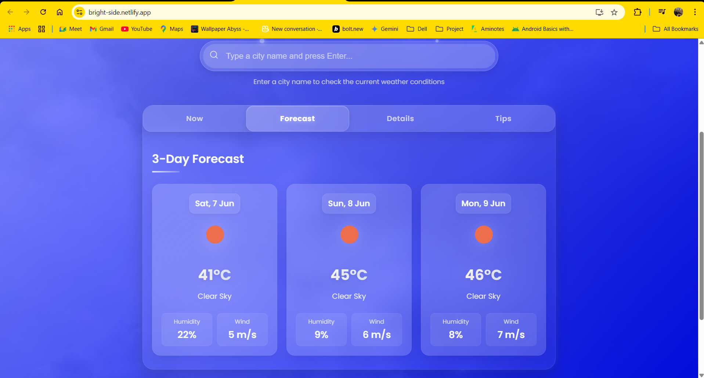
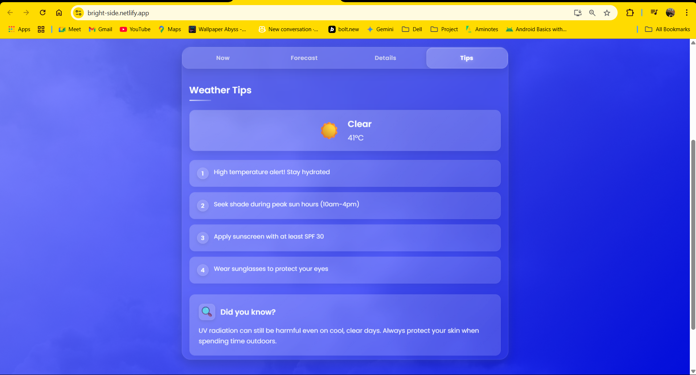

# 🌦️ BrightSide Weather Application

<div align="center">


[](LICENSE)

</div>

<div align="center">
  <h3>✨ Experience weather forecasts with style and elegance ✨</h3>
  
  [View Live Demo](https://bright-side.netlify.app/) | [Report Bug](https://github.com/sharmaram25/brightside/issues) | [Request Feature](https://github.com/sharmaram25/brightside/issues)
</div>

## 📱 App Preview

<div align="center">
  <p><strong>Home Screen & Search</strong></p>
  
  
  <p><strong>Weather Details</strong></p>
  
  
  <p><strong>3-Day Forecast</strong></p>
  
  
  <p><strong>Weather Tips</strong></p>
  
  
  <p><strong>Current Weather Card</strong></p>
  
</div>

## 🌤️ Overview

BrightSide is a modern, beautiful weather application meticulously crafted with React, featuring a stunning glassmorphism design with fluid animations and a thoughtfully curated color palette. The application empowers users to access detailed weather information through intuitive city search functionality or by selecting from popular cities in India.

Born from a passion for combining beautiful UI design with practical functionality, BrightSide transforms the everyday task of checking the weather into a visually delightful experience. The project demonstrates how modern web technologies can create applications that are both aesthetically pleasing and highly functional.

## ✨ Features

- **💎 Elegant UI** - Immerse yourself in a beautiful glassmorphism design with subtle gradient highlights that creates a modern, sophisticated feel
- **🔍 Intuitive City Search** - Effortlessly search for any city worldwide with real-time suggestions and error handling
- **🏙️ Popular Cities Dashboard** - Quick access to weather information for major Indian cities with just one click
- **📊 Comprehensive Weather Metrics** - Get detailed insights including current temperature, feels like, humidity, wind speed, air pressure, visibility, and UV index
- **🗓️ Multi-Day Forecast** - Plan ahead with accurate 3-day weather predictions including temperature ranges and condition summaries
- **📱 Fully Responsive Design** - Enjoy a seamless experience across all devices from smartphones to large desktop monitors
- **🎭 Immersive Animations** - Experience smooth, thoughtfully designed transitions and interactive elements powered by Framer Motion
- **⚡ Optimized Performance** - Fast loading times and efficient data handling for a snappy user experience
- **🌐 Progressive Web App** - Install as a standalone application on supported devices for offline capabilities

## 🛠️ Technology Stack

<div align="center">
  
| Category | Technologies |
|----------|-------------|
| **Frontend Framework** |  |
| **Styling** |   |
| **Animation** |  |
| **API Integration** |   |
| **Deployment** |  |
| **Development Tools** |   |

</div>

## 🚀 Installation and Setup

Follow these steps to set up the project locally:

### Prerequisites

- Node.js (v14.0.0 or later)
- npm (v6.0.0 or later)
- OpenWeatherMap API key (Free tier available)

### Installation

1. **Clone the repository**
   ```bash
   git clone https://github.com/sharmaram25/brightside.git
   ```

2. **Navigate to the project directory**
   ```bash
   cd brightside
   ```

3. **Install dependencies**
   ```bash
   npm install
   ```

4. **Create environment variables file**
   
   Create a `.env` file in the root directory:
   ```
   REACT_APP_OPENWEATHER_API_KEY=your_api_key_here
   ```
   > 💡 You can obtain an API key by signing up at [OpenWeatherMap](https://openweathermap.org/api)

5. **Start the development server**
   ```bash
   npm start
   ```

6. **Open your browser**
   
   Navigate to [http://localhost:3000](http://localhost:3000) to see the application running

## 📂 Project Structure

```
brightside/
├── public/               # Static files
│   ├── favicon files     # Various favicon sizes
│   └── index.html        # HTML template
├── scripts/              # Build and optimization scripts
│   ├── create-ico.js     # Favicon generation
│   ├── generate-favicons.js  # Multiple favicon size generation
│   └── optimize-build.js # Production build optimization
├── src/                  # Source files
│   ├── assets/           # Static assets
│   │   ├── favicon.svg   # Source SVG for favicons
│   │   └── images/       # Image files
│   ├── components/       # React components
│   │   ├── LoadingIndicator/  # Loading animation
│   │   ├── PopularCities/     # Quick access city buttons
│   │   ├── SearchBar/         # City search functionality
│   │   └── WeatherCard/       # Weather data display
│   ├── hooks/            # Custom React hooks
│   │   └── useWeatherData.js  # Weather data fetching logic
│   ├── utils/            # Utility functions
│   │   └── weatherAPI.js # API integration
│   ├── App.css           # Main application styles
│   ├── App.js            # Main application component
│   └── index.js          # Entry point
├── .env                  # Environment variables
├── netlify.toml          # Netlify configuration
└── package.json          # Dependencies and scripts
```

## 🏗️ Build and Deployment

### Build Process

```bash
npm run build
```

This command triggers a series of optimized build steps:

1. **Favicon Generation**: Creates all required favicon sizes
2. **React Build**: Compiles and bundles the React application
3. **Post-Build Optimization**: Compresses assets and optimizes for performance

### Netlify Deployment

BrightSide is configured for seamless deployment to Netlify using the `netlify.toml` configuration:

```toml
[build]
  command = "npm run build"
  publish = "build"

[[redirects]]
  from = "/*"
  to = "/index.html"
  status = 200
```

Key deployment features:

- **Continuous Deployment**: Automatically deploys when changes are pushed to the main branch
- **Environment Variables**: Securely configured in the Netlify dashboard
- **Preview Deployments**: Generated for pull requests to test changes before merging

## 🔄 API Integration

BrightSide seamlessly integrates with the OpenWeatherMap API to provide accurate and up-to-date weather information:

### API Endpoints Used:

- **Current Weather**: `/weather` endpoint for real-time conditions
- **Forecast**: `/forecast` endpoint for multi-day predictions

### Implementation Details:

The API integration is encapsulated in the `weatherAPI.js` utility file, which:

```javascript
// Example of the API call implementation
const getWeatherData = async (city) => {
  try {
    const response = await axios.get(
      `${API_BASE_URL}/weather?q=${city}&units=metric&appid=${API_KEY}`
    );
    return response.data;
  } catch (error) {
    throw new Error('Failed to fetch weather data');
  }
};
```

- **Error Handling**: Comprehensive error handling with user-friendly messages
- **Data Transformation**: Raw API data is transformed into a clean, application-friendly format
- **Caching Strategy**: Implemented to reduce unnecessary API calls and improve performance

## 📱 Responsive Design Implementation

BrightSide is built with a mobile-first approach, ensuring a seamless experience across all devices:

### Breakpoints System:

```css
/* Mobile (base styles) */
.weather-card {
  width: 100%;
  padding: 1rem;
}

/* Tablet */
@media (min-width: 768px) {
  .weather-card {
    width: 80%;
    padding: 1.5rem;
  }
}

/* Desktop */
@media (min-width: 1024px) {
  .weather-card {
    width: 60%;
    padding: 2rem;
  }
}
```

### Key Responsive Features:

- **Fluid Typography**: Text scales proportionally with viewport size
- **Flexible Layout Grid**: Adapts from single column on mobile to multi-column on larger screens
- **Touch-Optimized Controls**: Larger hit areas on touch devices
- **Content Prioritization**: Critical information is displayed prominently on all screen sizes

## 🎨 Design System

BrightSide implements a consistent design system throughout the application:

### Color Palette:

- **Primary**: `#5e72e4` - Brand blue, used for key UI elements
- **Secondary**: `#11cdef` - Accent color for highlights and interactions
- **Gradients**: Subtle blue-to-purple gradients for depth and visual interest
- **Background**: Semi-transparent with blur for glassmorphism effect
- **Text**: High contrast for readability with `#ffffff` on dark backgrounds and `#2d3748` on light

### Typography:

- **Primary Font**: 'Poppins', sans-serif - Clean and modern
- **Weight System**: 300 (light), 400 (regular), 600 (semi-bold) for hierarchy
- **Scale**: Based on a 1.25 ratio for harmonious progression

### Components:

- **Cards**: Consistent rounded corners (16px) with subtle shadows
- **Buttons**: Uniform height with appropriate padding for comfortable interaction
- **Icons**: Weather-themed icon set with consistent styling

## 🧪 Performance Optimizations

BrightSide incorporates various performance optimizations:

- **Code Splitting**: Lazy loading of components to reduce initial load time
- **Asset Optimization**: Compressed images and minified CSS/JS
- **Memoization**: React.memo and useMemo to prevent unnecessary re-renders
- **API Caching**: Intelligent caching of weather data to reduce API calls
- **Prefetching**: Strategic prefetching of likely-to-be-needed data

## 📊 Future Roadmap

BrightSide is continuously evolving. Planned enhancements include:

- **📍 Geolocation Integration**: Automatically detect user's location for instant local weather
- **🌓 Dark/Light Theme**: User-selectable appearance preferences with smooth transitions
- **🔔 Weather Alerts**: Real-time notifications for severe weather conditions
- **📈 Historical Data Visualization**: Interactive charts showing weather patterns over time
- **⭐ Favorites System**: Save and quickly access frequently checked locations
- **🔄 Background Adaptation**: Dynamic backgrounds reflecting current weather conditions
- **🌎 Internationalization**: Multi-language support for global users
- **🧩 Widget Support**: Embeddable widgets for other websites

## 🤝 Contributing

Contributions are what make the open-source community such an amazing place to learn, inspire, and create. Any contributions you make are **greatly appreciated**.

1. Fork the Project
2. Create your Feature Branch (`git checkout -b feature/AmazingFeature`)
3. Commit your Changes (`git commit -m 'Add some AmazingFeature'`)
4. Push to the Branch (`git push origin feature/AmazingFeature`)
5. Open a Pull Request

## 📝 License

This project is licensed under the MIT License - see the [LICENSE](LICENSE) file for details.

## 👨‍💻 Author

**Ram Sharma**

- LinkedIn: [Ram Sharma](https://www.linkedin.com/in/ram-sharma-20rs02)
- GitHub: [sharmaram25](https://github.com/sharmaram25)
- Instagram: [ramsharma.25](https://www.instagram.com/ramsharma.25)

---

<div align="center">
  <h3>☀️ Every day deserves a bright side ☀️</h3>
  <p>Made with ❤️ by Ram Sharma</p>
  
  
</div>

## Learn More

You can learn more in the [Create React App documentation](https://facebook.github.io/create-react-app/docs/getting-started).

To learn React, check out the [React documentation](https://reactjs.org/).

### Code Splitting

This section has moved here: [https://facebook.github.io/create-react-app/docs/code-splitting](https://facebook.github.io/create-react-app/docs/code-splitting)

### Analyzing the Bundle Size

This section has moved here: [https://facebook.github.io/create-react-app/docs/analyzing-the-bundle-size](https://facebook.github.io/create-react-app/docs/analyzing-the-bundle-size)

### Making a Progressive Web App

This section has moved here: [https://facebook.github.io/create-react-app/docs/making-a-progressive-web-app](https://facebook.github.io/create-react-app/docs/making-a-progressive-web-app)

### Advanced Configuration

This section has moved here: [https://facebook.github.io/create-react-app/docs/advanced-configuration](https://facebook.github.io/create-react-app/docs/advanced-configuration)

### Deployment

This section has moved here: [https://facebook.github.io/create-react-app/docs/deployment](https://facebook.github.io/create-react-app/docs/deployment)

### `npm run build` fails to minify

This section has moved here: [https://facebook.github.io/create-react-app/docs/troubleshooting#npm-run-build-fails-to-minify](https://facebook.github.io/create-react-app/docs/troubleshooting#npm-run-build-fails-to-minify)
