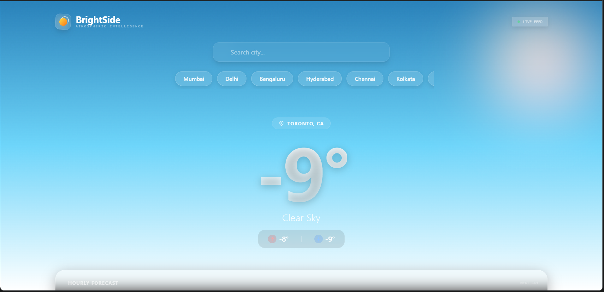
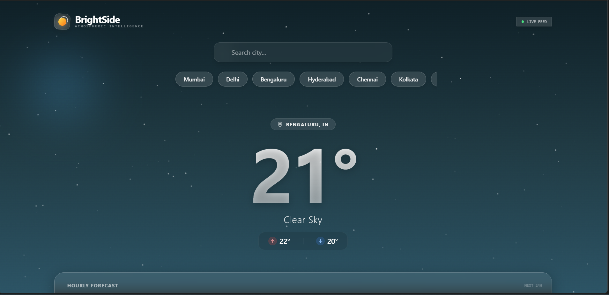
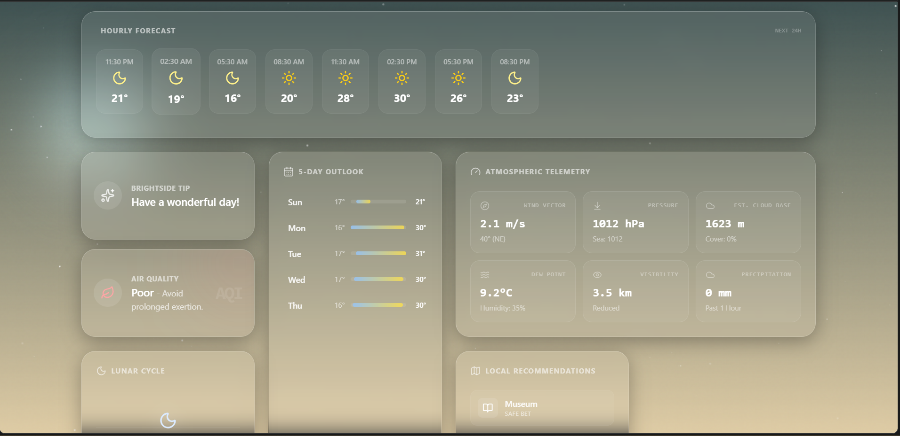
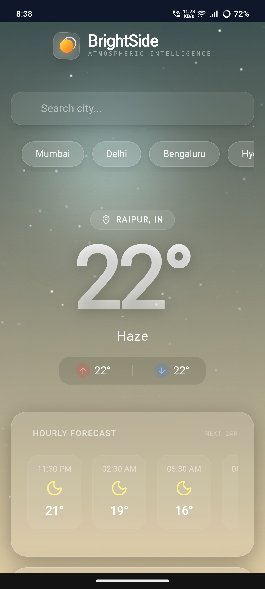

# BrightSide 🌤️

> **A visually immersive weather experience.**  
> *"See the brighter side of every sky."*

[](https://bright-side.netlify.app/)
 
 


---

## 🔮 The Experience

**BrightSide** is a modern weather app that combines real-time OpenWeather data with high-fidelity procedural visuals.

It adapts the UI based on time of day and current conditions to create a more engaging way to check the forecast.

### [🚀 Experience the Live App](https://bright-side.netlify.app/)

---

## 📸 Visual Showcase

> *BrightSide adapts its entire visual language based on the time of day and weather conditions of the viewed location.*

| **Day / Clear** | **Night / Rain** |
|:---:|:---:|
|  |  |
| *Dynamic sun positioning & volumetric clouds* | *Particle-based rain engine & lunar tracking* |

| **Bento Grid Layout** | **Mobile Responsive** |
|:---:|:---:|
|  |  |
| *Glassmorphic modules with hover physics* | *Fluid typography & touch-optimized controls* |

---

## ⚡ Engineering Artistry

BrightSide is built on the belief that **performance is a feature** and **animation is function**.

### 🎨 The Procedural Sky Engine
Unlike traditional apps that load heavy static image assets, BrightSide features a bespoke **Canvas Rendering Engine**.
*   **Algorithmic Gradients:** The sky color is not a static hex code. It is mathematically interpolated based on the **exact local time** of the target city (Dawn, Day, Dusk, Night).
*   **Physics Simulation:** Raindrops and snowflakes are individual particles governed by gravity and wind speed vectors from the API.
*   **Zero-Asset Load:** The entire visual experience is generated via code, ensuring sub-second load times even on 3G networks.

### 🎛️ The Glassmorphic Interface
*   **Bento Grid Architecture:** A sophisticated, masonry-style layout that dynamically reflows from a 4-column ultra-wide view to a vertical mobile stack.
*   **Optical Physics:** UI elements feature real-time background blurring (`backdrop-filter`) and border luminosity that mimics light refraction through glass.
*   **Kinetic Feedback:** Powered by `Framer Motion`, every interaction—hover, click, load—carries weight and spring physics, making the interface feel tactile.

### 🧠 Data Insights
*   **Solar Tracking:** Uses Bezier curves to plot the sun's trajectory relative to the horizon based on sunrise/sunset timestamps.
*   **Atmospheric Health:** Interprets complex Air Quality Index (AQI) data into actionable health advice and color-coded visual cues.
*   **Activity Guide:** Uses temperature, precipitation probability, and UV index to suggest context-aware activities.

---

## 🛠️ Technology Stack

| Domain | Technology | Use Case |
| :--- | :--- | :--- |
| **Core** | **React 19** | Component architecture & concurrent rendering |
| **Language** | **TypeScript** | Strict type safety & interface definitions |
| **Styling** | **Tailwind CSS** | Atomic utility classes & design system |
| **Motion** | **Framer Motion** | Spring physics, layout transitions, & gesture handling |
| **Graphics** | **HTML5 Canvas** | High-performance 2D procedural rendering |
| **Data** | **OpenWeatherMap** | REST API for Telemetry, Forecasts, and AQI |
| **Icons** | **Lucide React** | Lightweight, consistently stroked vector icons |

---

## 🚀 Deployment & Installation

### Live Environment
The application is deployed on a high-availability CDN.  
**URL:** [https://bright-side.netlify.app/](https://bright-side.netlify.app/)

### Local Development

1.  **Set up environment variables**
    Copy `.env.example` to `.env.local` and fill in your own key:
    ```bash
    VITE_OPENWEATHER_API_KEY=your_openweather_key
    ```

1.  **Clone the Architecture**
    ```bash
    git clone https://github.com/ramsharma/brightside.git
    cd brightside
    ```

2.  **Initialize Dependencies**
    ```bash
    npm install
    # or
    yarn install
    ```

3.  **Ignite the Dev Server**
    ```bash
    npm run dev
    ```
    Access the app at `http://localhost:3000`.

---

## 📂 Project Structure

A clean, modular architecture designed for scalability.

```text
assets/
    screenshots/
components/
services/
App.tsx
index.html
index.tsx
sw.js
types.ts
vite.config.ts
```

---

## 👨‍💻 Visionary & Creator

**Ram Sharma**  
*Creative Technologist*

> "I build interfaces that feel alive. BrightSide is an exploration into the poetry of data—proving that a weather app can be as moving as the weather itself."

---

## 📜 License

Distributed under the **MIT License**. See `LICENSE` for more information.
